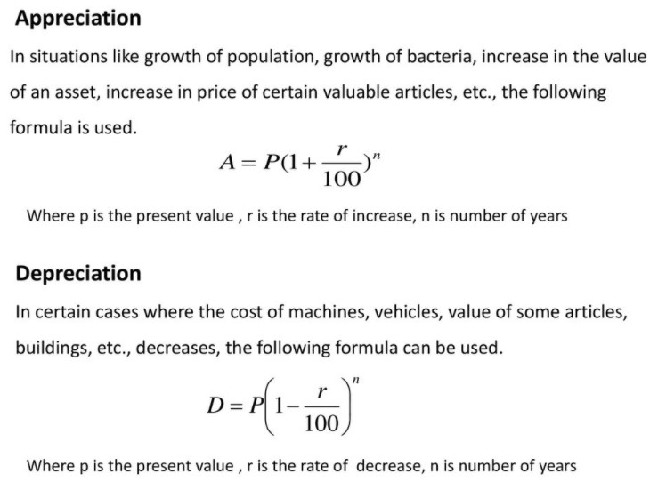

## Praktikum 2 | No. 3

Diberikan empat buah class Asset, BaseAsset, AppreciatingAsset, dan DepreciatingAsset. BaseAsset merupakan sebuah Asset yang menerima 1 parameter, yaitu buyValue. AppreciatingAsset dan DepreciatingAsset menerima 2 parameter, yaitu pointer Asset dan rate.

Semua file dibawah juga dapat diunduh melalui attachments.zip:
Asset.hpp Asset.cpp
BaseAsset.hpp
AppreciatingAsset.hpp
DepreciatingAsset.hpp
Asset memiliki sebuah fungsi virtual getValue yang menerima 1 parameter, yaitu years.
Implementasi getValue pada BaseAsset memiliki fungsi getValue akan mengembalikan nilai dari buyValue.

Anda diminta untuk membuat implementasi dari virtual function getValue pada AppreciatingAsset dan DepreciatingAsset.

Nilai dari AppreciatingAsset/DepreciatingAsset akan bertambah/berkurang seiring berjalannya waktu sesuai dengan rumus berikut:

Perlu diketahui bahwa nilai rate yang akan diberikan sebagai input tidak perlu dibagi lagi dengan 100.

Kumpulkan AppreciatingAsset.cpp dan DepreciatingAsset.cpp yang dizip menjadi Asset.zip.