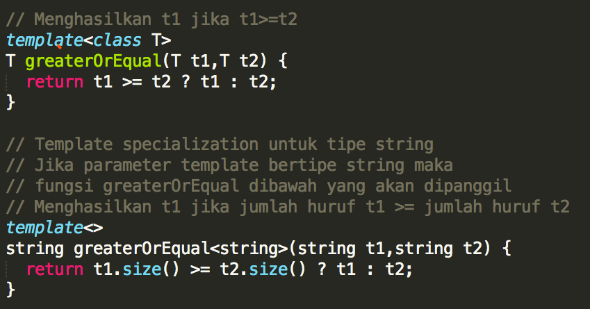

## Responsi 3 | No. 1

Buatlah sebuah file cpp yang berisi implementasi fungsi generik. Berikut kebutuhan dari fungsi generik pada praktikum ini.

1. Buatlah fungsi `func(param1, param2)` yang dapat menerima dua parameter input bertipe apapun dengan ketentuan: param1 dan param2 bertipe sama, dan param1 dan param2 boleh bertipe beda.
Jika param1 dan param2 bertipe sama, fungsi ini akan menghasilkan keluaran `"Masukan Anda: <param1> dan <param2>, memiliki tipe yang sama"` diakhiri dengan newline.
Jika param1 dan param2 mungkin bertipe beda, fungsi ini akan menghasilkan keluaran `"Masukan Anda: <param1> dan <param2>, mungkin memiliki tipe yang berbeda"` diakhiri dengan newline.

2. Terdapat kasus khusus untuk poin 1, yaitu ketika param1 bertipe char dan param2 bertipe int, fungsi ini akan mengeluarkan nilai param1 sebanyak nilai param2.
Contoh:

```func<char,int>('a', 2)
akan menghasilkan keluaran:
a
a 
```
HINT:

Berikut merupakan fitur template tambahan pada c++ yang dapat digunakan pada praktikum ini.

Template Specialization

Digunakan untuk membuat perlakuan khusus terhadap suatu class atau tipe tertentu.

