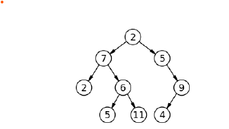

## Responsi 3 | No. 4

Tree adalah sebuah struktur data yang terdiri atas node yang terhubung satu sama lain sedemikian rupa sehingga menyerupai sebuah pohon fisik. Sebuah tree memiliki sebuah root node, dan setiap node pada tree memiliki 0 atau lebih children nodes, dengan batasan bahwa tidak ada hubungan (edge) antar node yang terduplikasi, dan tidak hubungan yang mengarah balik ke root node.

Struktur sebuah tree dapat dimodelkan secara rekursif, dimana setiap node adalah juga sebuah tree (atau subtree). Dengan menggunakan pendekatan rekursif ini, sebuah tree adalah sebuah node, dimana setiap node terdiri atas sebuah nilai data dan sekumpulan node yang merupakan anak (children) dari node tersebut (list of children nodes alias list of subtrees). Sebuah tree dikatakan sebagai binary tree manakala setiap node memiliki paling banyak 2 (dua) anak.

Sebuah struktur data tree dapat dibuat generik sehingga tipe dari nilai data pada setiap node dapat disesuaikan menurut kebutuhan aplikasi. Gambar berikut menunjukkan contoh sebuah binary tree dengan tipe data integer.

Buatlah sebuah kelas BinaryTree dengan menggunakan kelas generik dalam bahasa C++. Kelas memiliki beberapa fungsi berikut ini:

Default constructor dan copy constructor
Destruktor
Setter yang mengubah nilai data pada node.
Method yang menginisiasi dan menambahkan sebuah child node baru dengan sebuah nilai value dan mengembalikan node (subtree) yang baru ditambahkan. Gunakanlah exception untuk membatasi jumlah anak paling banyak 2

Petunjuk:

- List of children diimplementasikan dengan menggunakan vector dari STL C++.
- Lengkapi file `BinaryTree.hpp` berikut dan lumpulkan implementasi kembali dalam file `BinaryTree.hpp`

Lengkapi file `BinaryTree.hpp` berikut dan lumpulkan implementasi kembali dalam file `BinaryTree.hpp`

Update:

Ditambahkan using namespace std di file `BinayTree.hpp`
method addChild diubah, awalnya return `BinaryTree<T>*` sekarang menjadi `BinaryTree<T>&`